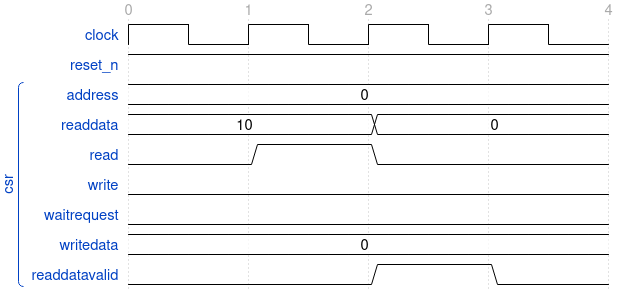

## Example JSON wavedrom diagram generation for a trace

```json
{
    "signal": [
        {
            "name": "clock",
            "wave": "p..."
        },
        {
            "name": "reset_n",
            "wave": "1..."
        },
        [
            "csr",
            {
                "name": "address",
                "wave": "=...",
                "data": "0"
            },
            {
                "name": "readdata",
                "wave": "=.=.",
                "data": "10 0"
            },
            {
                "name": "read",
                "wave": "010."
            },
            {
                "name": "write",
                "wave": "0..."
            },
            {
                "name": "waitrequest",
                "wave": "0..."
            },
            {
                "name": "writedata",
                "wave": "=...",
                "data": "0"
            },
            {
                "name": "readdatavalid",
                "wave": "0.10"
            }
        ]
    ],
    "head": {
        "tick": 0
    },
    "config": {
        "hscale": 3
    }
}
```

This is the output diagram of the generated JSON code

